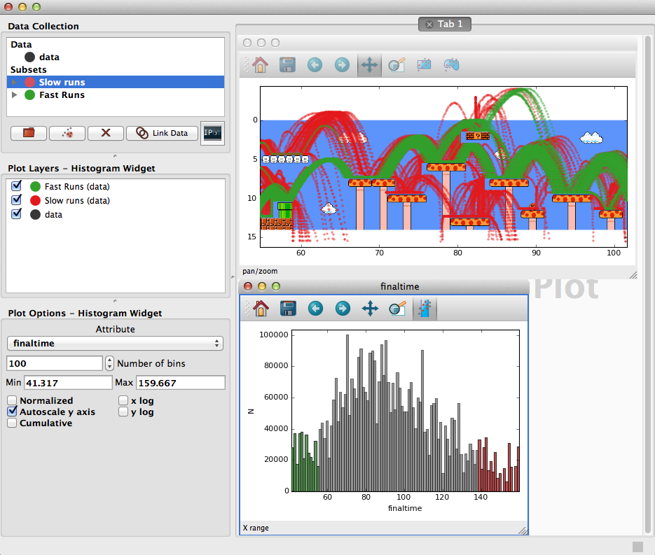
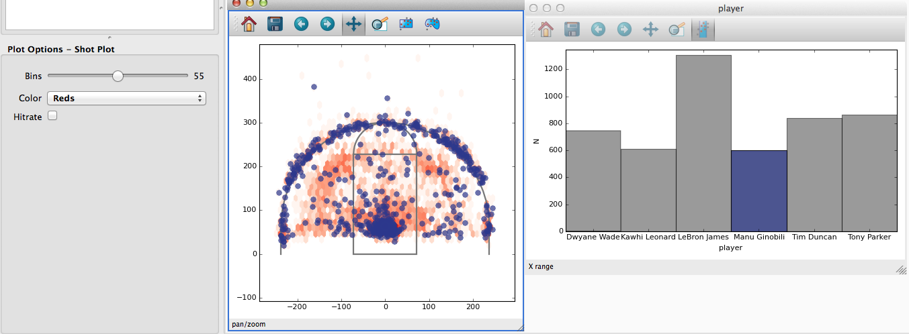

# User-Defined Viewer Gallery

A collection of user-defined Glue data viewers.

See the [Glue Documentation](http://www.glueviz.org/en/latest/custom_viewer.html)
for more information about building your own data viewer.

If you come up with something cool, add it to this repository!

### [Mario Viewer](mario/)

### [Shot Chart](basketball_shotcharts/)

### [Earthquake Map](earthquakes/)

